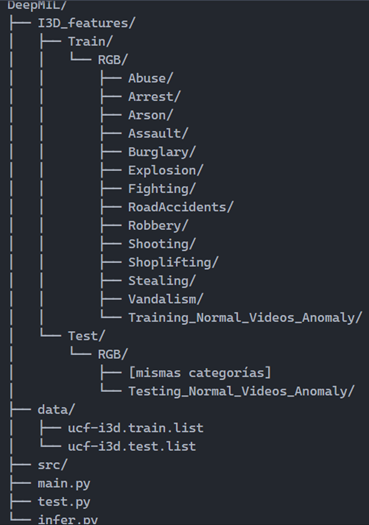

# Manual de instalación y ejecución del proyecto.

**1. Requisitos.**

* Python: 3.8 o superior.    
* GPU: NVIDIA con soporte CUDA.

**2.  Instalación de dependencias.**
Se recomienda crear un entorno virtual para aislar las dependencias necesarias a instalar.

Instalar paquetes necesarios: `pip install -r requirements.txt`

**Nota**: El archivo `requirements.txt` incluye PyTorch con soporte CUDA 11.8. Si necesitas otra versión de CUDA o solo CPU, ajusta el archivo `requirements.txt` según tu sistema.

**3.  Descarga y preparación del dataset.**

_3.1. Descargar características I3D._ Descargar el dataset UCF-Crime (características I3D extraídas) desde: [link al dataset](https://stuxidianeducn-my.sharepoint.com/personal/pengwu_stu_xidian_edu_cn/_layouts/15/onedrive.aspx?id=%2Fpersonal%2Fpengwu%5Fstu%5Fxidian%5Fedu%5Fcn%2FDocuments%2FUCF%2DCrime%2FI3D&ga=1)

_3.2. Estructura de carpetas._ Extraer y organizar el dataset según la siguiente estructura:
   

**4.  Estructura del proyecto.**
    Archivos principales:

- main.py: Script principal para el entrenamiento del modelo.
- test.py: Evaluación del modelo entrenado.
- infer.py: Inferencia en videos individuales.
- model.py: Arquitectura del modelo.
- dataset.py: Se encarga de cargar los datos.
- train.py: Lógica de entrenamiento.
- test.py: Lógica de evaluación del modelo.
- option.py: Configuración y parámetros.
- utils.py: funciones auxiliares.

Archivos de configuración:

* ucf-i3d.train.list: Lista de videos de entrenamiento.
* ucf-i3d.test.list: Lista de videos de prueba

**5.  Entrenamiento del modelo.**

_5.1. Entrenamiento básico:_
       `python main.py`
       
_5.2. Personalización de parámetros._ Los parámetros principales se encuentran en **option.py**. Puedes modificar:

* Learning rate: Tasa de aprendizaje (default: 0.0001)
* Batch size: Tamaño del batch (default: 32)
* Max epochs: Número de épocas (default: 100)
* Dropout: Tasa de dropout (default: 0.6)
* Model name: Nombre del modelo a guardar (default: "deepmil")

_5.3. Monitoreo del entrenamiento._ Durante el entrenamiento verás:
* Pérdida (loss) por época.
* Tiempo estimado restante.
* El modelo se guarda automáticamente en ckpt/[model_name].pkl

**6.  Evaluación del modelo.**

_6.1. Evaluar el modelo entrenado:_ `python test.py`
El script cargará el último modelo guardado en la carpeta **ckpt**

_6.2. Métricas obtenidas._ El script mostrará:
* ROC AUC: Área bajo la curva ROC.
* PR AUC: Área bajo la curva Precision-Recall
* Tiempo de evaluación
